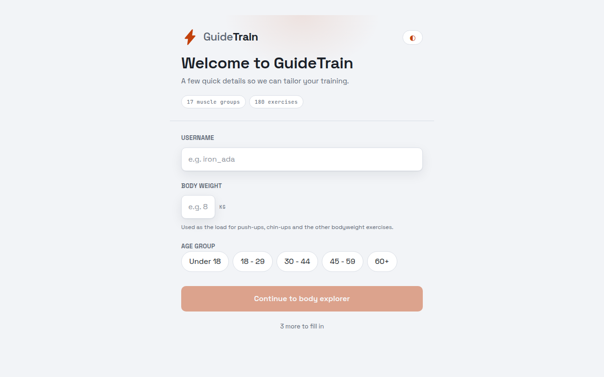
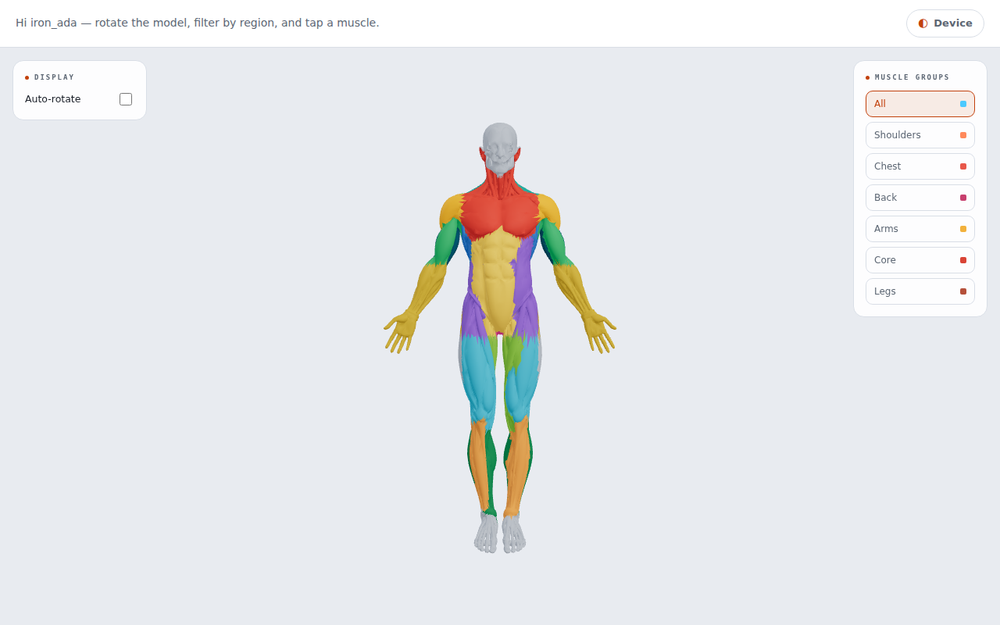
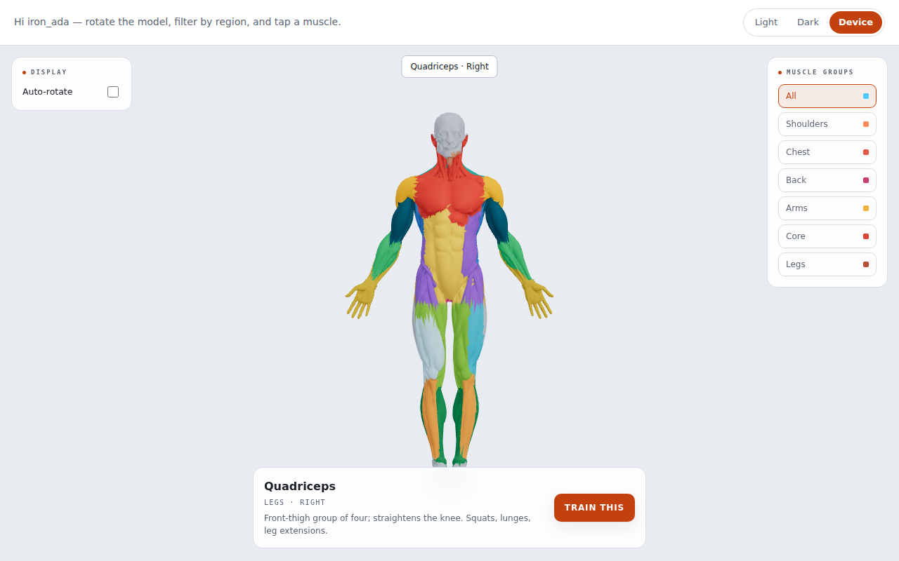
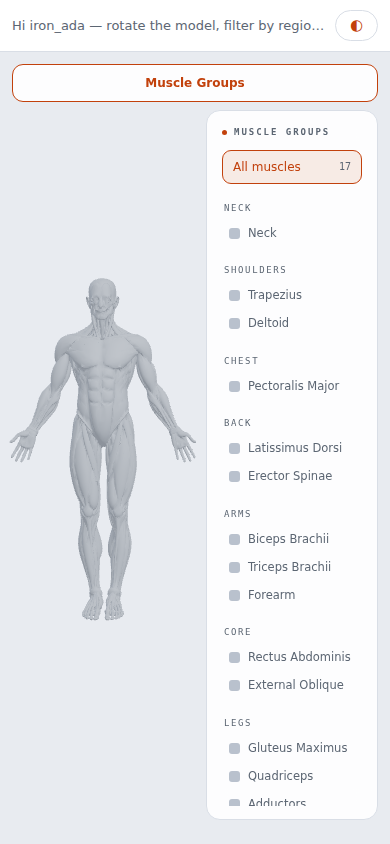

# GuideTrain

A gym training platform. Phase 1: pick your basics, then explore an interactive
3D anatomical model to see muscle groups.

## Screenshots

| Onboarding | Body explorer |
| --- | --- |
|  |  |

| Muscle group selected | Mobile |
| --- | --- |
|  |  |

Regenerate them with the web dev server running: `node docs/screenshots/capture.mjs`.

## Structure

- `apps/web` — React + Vite + TypeScript + react-three-fiber frontend
  - `src/anatomy` — the 3D muscle picker (viewer, zone lookup, muscle data)
- `apps/api` — Express + TypeScript + Prisma (SQLite locally). Not used by the
  viewer yet; kept for the accounts/programs phases.
- `data/muscle-groups.json` — category data for the API's Prisma seed, separate
  from `src/anatomy/muscle-map.json`, which drives the viewer's zones.
- `tools/muscle-segmentation` — the build that turns the painted model into the
  shipped `.glb`. See [its README](tools/muscle-segmentation/README.md).

## The 3D model

`apps/web/public/models/anatomy_{full,mobile}.glb` is derived from a **Meshy AI
(Meshy 6)** generation released under **CC0 1.0** (no rights reserved, no
attribution required — this credit is good practice, not obligation), with each
muscle group then hand-painted a distinct colour in the source texture.

Those painted colours are what define each muscle. The build reads them and
turns them into geometry rather than approximating muscles with boxes: triangles
are sampled at their UV centroids, grown into connected regions of one tint, and
expanded across the untinted surface between them. That yields ~110 regions,
grouped into **20 zones** — one per muscle, covering both sides, since left and
right biceps are the same thing to train — baked onto every vertex as the glTF
`_ZONE` attribute. Picking at runtime is just reading that number
(`apps/web/src/anatomy/zoneMapping.js`).

Because zones follow the artwork, muscle edges are exact. The earlier approach
fitted an axis-aligned box per muscle; boxes overlapped, so an arm box would
reach across the torso and claim part of the back.

Textures aren't shipped — the viewer paints from its own palette, so the model
carries only geometry and the zone attribute: 1.1 MB (60k faces) for mobile,
3.6 MB (150k faces) for the full one.

**How the labelling is kept honest** — measured landmarks instead of assumed
heights, front/back decided by which way a region's surface faces, the model
folded onto itself so left and right always agree (0.73% mirror disagreement,
`tools/muscle-segmentation/check-symmetry.py`), and borders smoothed on the
decimated mesh. All of it, with the numbers, is in the
[pipeline README](tools/muscle-segmentation/README.md).

**The body turns on its own.** There used to be a checkbox for it, which meant
the back of the model was reachable only by someone who had opened a panel and
found the switch — most people saw a front view and assumed that was all there
was. Rotating by default shows there is a back without anyone being told, and
dragging still overrides it mid-turn. Under `prefers-reduced-motion` it is held
still and stays that way, watched live rather than read once: a body that never
stops moving is precisely what that setting is asking about.

## Colour

**The body is one colour until you ask it a question.** Grey — dark against the
dark canvas, light against the light one — with the muscle you pick wearing the
theme's own orange, and nothing else wearing anything. Open an exercise and the
muscles it works take that orange, the ones it merely uses take a softened
version of it, and the rest of the body drops back.

It used to arrive wearing seventeen colours, one per muscle, doubling as the
picker's legend. That showed everything at once and so emphasised nothing: a
body already lit up in every direction has no way left to answer *which one is
the quadriceps*, because the answer was on screen along with sixteen others.
The traced borders between muscles stay, so the map is not lost — only the
shouting. The picker's swatches say the same thing the body does: a row of quiet
marks, and the one you picked lit up.

Three colours per theme carry it, in `AnatomyModel.jsx`: the body, the dropped
back, and the accent. The supporting-muscle tone is derived from the accent
rather than picked, so it tracks whatever the accent is. The 3D canvas can't
read CSS custom properties, which is why the accent is written out there as well
as in `index.css`.

`MUSCLE_COLORS` and `tools/muscle-segmentation/palette-design.py` are kept but
no longer applied — seventeen hues separated by OKLab distance under normal
vision and under simulated colour blindness, against both canvases. The work
holds if per-muscle colour ever comes back; the reason it went is above, and it
isn't that the palette was bad.

## Exercises

Selecting a muscle lists the exercises that train it — step-by-step
instructions, equipment, difficulty, and a YouTube search link (a search rather
than a fixed video id, so it can't rot and needs no API key). **Train This**
opens one of them, for anyone who wants to train the muscle and doesn't want to
choose which way; the list underneath is still there for anyone who does.

It deals from a shuffled bag rather than rolling a die: every exercise comes up
once before any comes up twice, and a refill that would start on what just
played steps aside one place, so the seam between two bags can't repeat either.
Rolling a die looked broken — eight presses on a four-exercise muscle returned
three distinct videos. Changing muscle deals a fresh bag. Only exercises with a
video are drawn from; every one has one today, but ids rot and `--revalidate`
drops the bad ones, and that guard is what keeps the button from opening an
empty player. 180 exercises
across all 17 zones, built by `tools/exercises/build-exercises.py` from the
[Free Exercise DB](https://github.com/yuhonas/free-exercise-db), which is public
domain under the Unlicense.

**No third-party images are bundled.** That dataset ships photos, but they carry
no stated licence — the question was [asked in 2024](https://github.com/yuhonas/free-exercise-db/issues/12)
and closed unanswered, and the upstream doesn't say where they came from. Every
other reachable illustrated set was worse. So an exercise is illustrated on the
app's own model instead: opening one lights the muscles it trains, primary solid
and secondary dimmed. That is more useful than a stock photo and entirely ours.

Two zones needed work the source couldn't do. It has no oblique category — all
rotation and side-bending sits under "abdominals" — so those are separated by
movement. It has nothing usable for tibialis anterior, so six exercises are
named in the build script and marked `"source": "curated"`.

### Video

All 180 exercises play a real demonstration in the app, in a click-to-load
`youtube-nocookie` player — nothing is fetched from YouTube until you open one.
Anything that ever loses its video falls back to a search link, which always
works. A *search* cannot be embedded
(YouTube removed `listType=search` in November 2020), so this needs real video
ids:

```bash
YOUTUBE_API_KEY=... python3 tools/exercises/resolve-videos.py
```

That runs at build time and writes the ids into `exercises.json`, so the shipped
app carries no key — which matters on GitHub Pages, where anything in the bundle
is public. The binding limit is a flat **100 `search.list` calls a day** — one
per exercise — rather than the 10,000-unit pool, which covers the other
endpoints; already-resolved exercises are skipped, so it can be run across
several days. (Exhausting it returns **429 `rateLimitExceeded`**, not the 403
`quotaExceeded` the docs imply, and only in the response body — so the script
reads the body and stops rather than reporting every remaining exercise as
broken.) It also checks each video is actually embeddable, since an owner can
forbid it and such a video would open an empty player.

**A wrong video is worse than none**, so a result is kept only if its title
shares a meaningful word with the exercise name. What counts as meaningful is
the whole trick. A single letter or a bare number does not — neither identifies
a movement, and letting them count is how "V-Bar Pullup" matched *Top 9 Lats
Exercises for a V-Shape Body*. Nor do posture and setup qualifiers: half the
catalogue is "standing" or "seated" something, so agreeing on one is no
evidence, which is how "Standing Olympic Plate Hand Squeeze" reached *How to do
Standing Military Press*. "bar" is shared by pullup bars, barbells and T-bars
alike, and it paired "V-Bar Pullup" with a *V Bar Pulldown*. A trailing plural
is folded, so *T-Bar Rows* still meets "T-Bar Row".

Sharing a word is necessary and not sufficient. "Seated Dumbbell Curl" and
*Incline Dumbbell Curl* share two and are done on different benches; "Band Hip
Adductions" was showing a *Banded Hip Abduction*, which is the opposite
movement on a different muscle. So a title is also rejected when it
**contradicts** the name. Two ways it can:

- **Mutually exclusive qualifiers.** Nothing is both seated and incline, and a
  barbell is not a Smith machine. Several of these words are in the stop list
  above — they carry no weight as agreement, because half the catalogue is
  "seated" something, but they are decisive as disagreement. *A word can be
  worthless as evidence of a match and conclusive as evidence of a mismatch.*
- **A qualifier the title is missing.** A "Cable Reverse Crunch" video titled
  *Cable Crunch* is not a differently worded match, it is the other exercise.
  Checked one way only: the name is the specification, and a title carrying an
  extra qualifier is usually just being more precise.

Synonyms have to be taught, or the test reads them as conflicts — "leverage" in
this catalogue means a plate-loaded machine, which titles call Hammer Strength,
isolateral, or just the machine; a rope is what hangs off a cable. Without those
the rule threw away two correct videos.

Separately, **no two exercises share a video**. Each was resolved knowing
nothing about the others, so one cable crunch video had been handed to four of
them, and Train This — dealing a different exercise each press — opened the same
video twice running and looked broken. `--dedupe` leaves it with whichever name
the title matches best and re-searches the rest, and a search now passes over
anything already taken while another candidate remains. A shared video is still
accepted as a last resort: two exercises on one demonstration beats one exercise
on none.

The top hit for a less common movement is often a general muscle video:
"Reverse Barbell Curl" came back with *BIGGER Forearms Workout*. The gate
rejects those and keeps differently worded good matches — "Romanian Deadlift"
still meets *RDL Tutorial* through a small alias table, and "Standing Olympic
Plate Hand Squeeze" now opens *How to - Plate Pinch*. `--revalidate` re-checks
ids already in the file and drops any that fail, which is how the two above were
caught. Rejects fall back to the search link, which always works.

An API key is free and needs no billing. It reads public data only: it cannot
touch a YouTube account, and it isn't used at runtime, so it can be deleted once
the ids are baked in.

Anything without an id keeps the YouTube search link, and the player always
offers that way out too — video ids rot, and all 180 having one today is
not a promise they still will, which is why the search link exists in the first
place. **Train This only deals from exercises that have a video**, so it never
opens an empty player; every muscle has at least four, the neck fewest.

Coverage fell from 180 to 174 when the contradiction rules landed — the rule
working, not a regression: those six had been showing the plain version of the
movement. All six came back, and none of it by lowering the bar:

- **Ask the right question.** The catalogue says "Suspended Row"; the world says
  *TRX row*, and a literal search returns barbell rows all day. `SEARCH_AS` maps
  those names for the query only. The answer is still judged against the real
  name by the same gate, so a better question cannot admit a worse video.
- **Teach the synonyms.** TRX, strap and suspension all mean "suspended". A
  reverse calf raise is dorsiflexion, which everyone who films it calls a
  *tibialis* raise.
- **Waive a word only where the evidence says it distinguishes nothing.** A
  cable kickback has no two-legged version, so no one writes "one" in the title
  — twenty candidates across two searches, not one of them did. That waiver is
  listed per exercise in `NOT_DISTINGUISHING`, so "Dumbbell One-Arm Upright Row"
  still refuses a two-arm video.
- **Take the closest match, not the first acceptable one.** The gate says
  whether a candidate is *acceptable*; among those that are, the one sharing the
  most words with the exercise name now wins, with search rank breaking ties.
- **A `SEARCH_AS` query is used verbatim.** Every other search appends
  "exercise proper form", which steers a bare exercise name towards
  demonstrations — and drowns a query that is already specific. `leg press
  tibialis raise` returns the one video actually filmed on a leg press at rank
  0; the same words plus that suffix pushed it out of the top ten.

### Training pairs

Selecting a muscle also suggests three exercises to superset with — something
to do in the rest between sets, so the pause trains something instead of
nothing. They sit directly under **Train This**, above the exercise list.

Tapping one opens **the written instructions**, with the demonstration offered
at the bottom of them. It used to open the video straight away, which answered
"show me" before anyone had asked "what is it" — and between sets, reading four
lines costs a moment where a video costs the whole rest.

The suggestion sharpens as the question does. Before an exercise is chosen it
can only answer for the muscle's own region; open one and it answers for that
exercise, which knows its secondary muscles too. A bench press loads the
triceps and a chest fly barely does, so until you say which you are doing, the
weaker claim is the only honest one.

A partner has to be **non-competing**, and the whole question is what that means
against real data. Region of the *primary* muscle alone is not enough: a lat
pulldown is Back and a biceps curl is Arms, so by that test they pair — and both
load the biceps, which is why your arms give out on the second set. 13% of
ordered pairs in the catalogue differ on exactly that point.

So the rule takes every muscle an exercise names, **primary and secondary**,
maps each to its region, and requires the two sets of regions to be disjoint.
Because a muscle belongs to exactly one region, that subsumes "no shared
muscle" — two exercises sharing no region cannot share a muscle. One rule
instead of two, and the stricter of them.

It is affordable: every one of the 180 exercises keeps **at least 4** legal
partners and the median is 91, so nothing is left unpaired.

With that many candidates the ranking is what makes the suggestion useful
rather than merely legal — a demonstration you can watch, then no extra kit
(body-only, or failing that the equipment you are already standing at), then
the same difficulty. The three shown are spread across different primary
muscles, because three legal partners that are all calf raises answer the wrong
question. Ties break on id, so an exercise proposes the same partners every
time: a plan, not a slot machine.

    node tools/exercises/check-pairs.mjs

checks the rule against the shipped catalogue — no suggested pair shares a
region or a muscle, none of the 180 is left without a partner, and the
suggestions are stable between calls. It exits non-zero, so it can gate a build.

### wger, and why it isn't used

wger's catalogue is CC-BY-SA with proper per-image licence and author fields,
and share-alike is acceptable here — but it doesn't fit. Matching its images
onto this list by name hits **4%**; loosening the match to reach 21% starts
pairing "Barbell Curl" with "Barbell Wrist Curl", and a wrong illustration is
worse than none. Pairing images correctly would mean rebuilding the list from
wger records, which has **no exercises at all** for neck, erector spinae,
forearms, adductors or tibialis anterior — five of the seventeen zones — and
only a third of its exercises carry an image.

## Languages

Ten: English, Czech, German, Spanish, French, Polish, Portuguese, Russian,
Simplified Chinese, Japanese. **The device decides, and only the device** —
`navigator.languages` is negotiated against that list on load, and a
`languagechange` event re-runs the negotiation without a reload. There is no
picker: the phone already knows what language you read, and a control that
duplicates a setting you have made once is a control that can disagree with it.

The trade is real and worth naming: someone whose device is set to a language
they would rather not read the app in has no way to say so here. That is a
setting on the device, one screen away, and it is the one that will still be
right tomorrow.

Regional tags collapse (`pt-BR` and `pt-PT` both get `pt`, `es-419` gets `es`),
any `zh` lands on Simplified, and anything unsupported falls back to English.
Only the active language is downloaded: each is its own ~4 KB chunk, with
English in the main bundle because it is also the per-key fallback — an
untranslated key renders English rather than a raw key.

Translated everywhere: the whole interface, all 20 muscle names and
descriptions, the region and equipment labels.

Exercise names and instructions are a much larger job — 180 names and 815 steps,
~23,000 words per language — and **all nine are now done**, in
`src/i18n/exercises/<locale>.json`. They are lazy-loaded apart from the
interface (~27–31 KB gzipped each) and fetched only when a muscle is opened, so
the chunk every visitor waits on stays ~4 KB. A key without a translation falls
back to the English text, so a gap reads as English prose inside a translated
app rather than as breakage.

    node tools/i18n/dump-exercises.mjs <from> <to>   # source text to translate

Counts use `Intl.PluralRules`, so Polish, Russian and Czech get their three
forms (`5 ćwiczeń`, not `5 ćwiczenia`) rather than an English two-form guess.
`node tools/i18n/check-locales.mjs` checks every locale against English for
missing keys, dropped `{placeholders}` and missing plural forms.

## On a phone

The muscle picker floats over the canvas. That is fine when there is room
beside the model and useless when there isn't: at 390px it covered 44% of the
width, and at 320px the body was reduced to one arm and a pair of legs behind
it. Below 720px choosing a muscle closes the picker — otherwise it would hide
the muscle you just picked — and the toolbar button brings it back. Tapping
outside dismisses it.

The muscle list stays docked on the right, because it is the point of the
screen — an empty canvas with the list behind a button reads as nothing to do.
The body steps aside for it rather than hiding behind it, and does the same
when opening a muscle raises the exercise sheet over the lower half: it shifts
by half of whatever is covered and scales to fit what's left, then settles back
when the sheet closes.

How much is covered is *measured*, not assumed — the sheet is shorter for a
muscle with four exercises than for one with twelve — and the fit comes from
the body's own bounding box, since the same model fills a quarter of a
desktop's width and four fifths of a phone's. The model moves, not the camera,
so orbiting and zooming still belong entirely to you.

Exercise names wrap instead of truncating. "Standing Palms-Up Barbell Behind
The Back Wrist Curl" has no useful prefix, so an ellipsis told you nothing, and
the translations run longer than the English.

The model is 1.1 MB, so the canvas now says it is loading rather than sitting
empty. The overlay clears when the body is painted, which is the honest moment
— the environment map may still be arriving, but there is something to look at.

## Type

**Space Grotesk** for text, **JetBrains Mono** for labels and figures, both
self-hosted. A `<link>` to Google's CDN would tell a third party which pages a
reader opens, and the app declines that trade elsewhere — the video player
fetches nothing from YouTube until it is clicked — so the files are in the repo
under `apps/web/src/assets/fonts`, SIL OFL 1.1 with both licences beside them.

Two stacks, `--sans` and `--mono`, declared once in `index.css` and inherited
everywhere. They used to be written out at each call site and the two didn't
agree: the canvas asked for `'Space Grotesk', system-ui, sans-serif` while the
page asked for `system-ui, "Segoe UI", Roboto` — identical wherever `system-ui`
resolves, different where it doesn't. And neither named face was bundled at
all, so for a long time every visitor read the fallback on every screen.

Variable fonts, split by script: 106 KB in total, but nobody downloads that.
The browser fetches only the subsets a page needs, keyed by `unicode-range` —
English pulls two files (62 KB), Polish four, Russian three. Space Grotesk has
no Cyrillic, so Russian body text falls back per glyph while its mono labels
don't; Japanese and Chinese are in neither face and fall back entirely, which
is right, since a CJK webfont is megabytes and every device already has one.
`font-display: swap` keeps text readable from first paint.

Form controls don't inherit type from the page; they take a UA font unless told
otherwise. `button` was already handled, `input` was not, which is why the one
text input on the site rendered in Arial while everything around it didn't.
`button, input, select, textarea { font: inherit }` covers the rest.

    python3 tools/fonts/fetch-fonts.py   # re-download and regenerate fonts.css

## Body weight

Asked for on the first screen, as an exact figure to the nearest whole unit
rather than a band. Age is context and a band is fine for it; body weight is
arithmetic — it is the load on all **29 bodyweight exercises** in the
catalogue, and you cannot put a band on a bar.

Which is why **a push-up asks for reps alone.** Its load is the person doing
it, so a weight field there is a question with only one honest answer, and one
more thing to type while holding a phone mid-set. The weight is still recorded,
so the set reads `82 kg × 10` like any other and counts towards a plan; it just
isn't asked for. A line under the field says where the number came from, so
typing `10` and getting `82 kg × 10` is explained rather than surprising.

Two cases fall back to asking, both deliberately: a profile saved before this
field existed, and a body weight recorded in the other unit — converting
silently would put a number on screen nobody entered. Like everything else
here, it stays on the device.

## Ready-made plans

Three shapes — full body, upper/lower, push/pull/legs — previewed **with the
weights you would actually use**, then added as named workouts with their
targets already set. A plan that says "Barbell Squat, 3 × 5" still leaves you a
decision in the gym; one that says 77.5 kg does not.

Each is a common structure rather than anything invented here, and each is
built only from exercises this catalogue has.
`node tools/exercises/check-plans.mjs` fails if a plan ever names one it
doesn't, or omits a starting weight, since either would render a blank row.

### Where each weight comes from

Two sources, deliberately not the same kind of thing, and every row says which
it is:

- **From your lifts** — your best logged set, through Epley, backed off a tenth
  to a weight you can finish. A calculation.
- **Starting point** — body weight × a per-exercise fraction, adjusted by sex
  and age band. A population average, not a measurement of you.

**There is no path from body weight to a one-rep max.** The estimated max is
what drives the 5/3/1 planner, and it has to come from a set that happened;
feeding it a demographic guess would launder an average into a personal record.
So the no-history path outputs a first working set and labels it as one, with
the instruction to treat it as a test.

The fractions are chosen light, because the costs are not symmetric: a set that
turns out easy costs one set, and a set that turns out heavy costs a back. The
person receiving these numbers is by definition the one with nothing logged —
the least able to tell that a number is wrong. Under-18s take the most
conservative factor in the table, and "prefer not to say" takes the lower of
the two sex figures rather than a guess.

Nothing barbell is ever prescribed below **20 kg**, an empty Olympic bar. That
floor reads the equipment field from the catalogue rather than the exercise id
— an earlier version tested whether the id began with "Barbell", which is false
of "Standing Military Press", and a light profile was told to press 7.5 kg.

## Named workouts

Several workouts rather than one, switched with a row of tabs at the top of the
panel: a push day and a leg day are different lists, and keeping them apart is
most of what a program is. New, rename and delete are all there; delete is only
offered once there is a second one to fall back to, since it takes the
exercises with it.

**Names are stored as typed, or not at all.** An unnamed workout displays as
"Workout 1", "Workout 2" — numbered by position and translated at render, so it
reads as *Training 1* in German. Storing that generated label would freeze it
into whichever language happened to be on when it was made, which is the same
mistake as storing exercise names instead of ids.

The single list this replaces is migrated into the first workout on the first
load and its old key removed, so nothing anyone built is lost. Saving an
exercise with no workout open creates one rather than quietly doing nothing —
the **+** is the first thing anyone presses.

### Targets

Each exercise can carry a target — `3 × 5` — shown as a row of pips beside it,
and a line at the top counts how many exercises are finished.

**The pips fill from the log. Nothing is tappable to tick.** That is the whole
design: a tick you set yourself would be a second account of the same session,
free to disagree with the sets you recorded, and then one of the two is wrong
and the app cannot say which. Logging a set *is* the tick — delete a logged set
and the pip empties again.

Overshooting is shown rather than clamped. A fourth set against a target of
three draws a fourth, outlined pip: it happened, and hiding it would put the
log and the pips back into disagreement, which is the one thing this shape
exists to prevent.

A target is a plan, so it lives on the workout; the sets are a record, so they
live in the log. Removing an exercise takes its target with it, or the target
outlives the exercise and comes back with it later.

## Inside a workout

A list you build from the explorer: **+** beside any exercise adds it,
the header button shows the count, and opening it gives you reorder, remove and
clear. Reordering is buttons rather than drag — a drag target is hard to hit on
a phone, impossible from a keyboard, and the list is short enough that two taps
beat a gesture.

**It stores ids, not exercises.** The text is 23,000 words per language and
already in the bundle, so saving a copy would be saving a *stale* copy: it would
keep whatever names were current when you saved, in the language you saved them
in. Looking each id up at render means a workout saved in English opens in
Polish, and a corrected instruction shows the correction. Verified: saving
`Barbell Bench Press - Medium Grip` and reopening under `pl-PL` gives
*Wyciskanie Sztangi na Ławce Płaskiej - Chwyt Średni*.

It lives in `localStorage` beside the profile, because the site is static on
GitHub Pages and there is nothing to sync to. So it is **per-device and per
browser**, which is the honest limit of a static app and precisely what accounts
would change.

`AnatomyViewer` stays a drop-in: it takes optional `savedIds` and `onToggleSave`
and renders the control only when both are given. It knows how to offer an
exercise and nothing about where it goes.

### Logging what you lifted

Each exercise in the workout takes sets: a weight and a rep count, recorded
against it with today's date. Today's sets show as pills, the heaviest set ever
recorded shows underneath, and a mis-tap is removable.

The weight field keeps its value between sets and the reps field clears, because
the weight usually repeats across a set and the reps usually don't. A comma is
accepted as the decimal separator — it is the separator in most of the ten
languages, and `parseFloat("62,5")` silently returns `62`.

**Kilos, everywhere.** Weights briefly carried a unit beside them and no longer
do, which removes a whole dimension: nothing has to ask whether two numbers are
comparable before comparing them. An entry written in pounds is converted once
on read and written back — leaving it to be read as though 225 meant kilos
would put a wrong number on screen, which is the one thing worse than a missing
one.

The best figure is a set that actually happened, not an estimated one-rep max.
Estimating is the progression feature's job, and its formulas want checking
against sources before anything is shown as a number; a real set needs no
formula to be right. That is also the point of recording sets at all — an
estimate from a set you performed is a calculation, and a typed-in "my max is
100" is a claim, and the two should never share a field.

### Getting to the next max

Once an exercise has a usable logged set, **Plan** shows the way from the max
you have to the max you want: an estimated one-rep max, a target you set, and
how many four-week cycles it takes, with the loads for each week.

**There is no field for typing in your max.** That is the point. An estimate
from a set you performed is a calculation; a number you typed is a claim; and a
plan that cannot tell them apart will happily build eight weeks on a guess. The
set the estimate came from is shown beside it, so the figure is checkable
rather than asserted.

The maths, checked against sources rather than recalled:

- **Epley**, `1RM = w × (1 + reps/30)`, for the estimate. A single rep is
  returned as itself instead of run through the formula — Epley at 1 rep gives
  `w × 1.033`, so a 100 kg single would be reported as a 103.3 kg max, and a
  set of one *is* a one-rep max. Only offered up to 12 reps: past that the
  formula extrapolates well beyond what the set showed, and a confident wrong
  number is worse than none.
- **Wendler 5/3/1** for the plan. Training max at 90% of the estimate; week 1
  65/75/85, week 2 70/80/90, week 3 75/85/95, week 4 deload 40/50/60; the last
  working set taken for as many good reps as you can. Cycles add 5 kg to
  lower-body lifts and 2.5 kg to upper-body ones — which is Wendler's split by
  lift, applied by asking whether the movement loads the legs at all, since the
  exercise data already knows. A deadlift names the erectors first and the legs
  second, so looking at both is what puts it on the right side.
  ([BarBend](https://barbend.com/5-3-1-program/),
  [ExRx](https://exrx.net/WeightTraining/Powerlifting/531))

**The gym's smallest plate is 1.25 kg, so the bar moves in 2.5 kg steps** — plates go on in pairs, and 87.5 kg is not a weight you can
build. Every working load rounds to that step. The *training max* deliberately
does not: it is a number to calculate from rather than a weight to load, and
rounding it would drag every percentage below it with the same error and make
the 2.5 kg upper-body increment impossible to apply at all — two cycles would
come out identical.

The panel steps through the cycles rather than showing only the first — the
same four weeks at a training max `increment` higher each time, which is where
the progress actually comes from. It also says so, because "2 cycles, about 8
weeks" above a four-row table is a question the app should answer itself.

**The plate size is load-bearing, not cosmetic.** It was briefly 2.5 kg, which
puts the bar on 5 kg steps — and 5 kg of training max is only 4.75 kg at 95%,
so a whole cycle's increase rounded away and cycles 1 and 2 called for
identical weights. At 1.25 kg every cycle moves. The panel still detects a
repeat and explains it, because a heavier plate rack or a smaller increment can
reproduce the situation; `SMALLEST_PLATE` is the one number to change.

Worked example, the one this was built against: a 100 kg × 5 squat estimates a
117.5 kg max, giving a 105 kg training max and a first week opening at 67.5 kg
— the backing off — and reaching a 127.5 kg target takes **2 cycles, about 8
weeks**. The same target on a bench press takes 4, since upper-body lifts move
at half the rate.

### When it doesn't go up

A plan that only describes success is the part that gets somebody hurt, so the
panel reads the log back against the cycle on screen and marks each week's top
set hit or missed. The minimum is the programme's own: five in week one, three
in week two, one in week three, on the last and heaviest set. Falling under it
is the training max saying it is too high.

The answer is **not** to try again heavier. That lift's training max comes down
10% and rebuilds — only that lift, since the others are progressing fine.
"Two steps forward, one step back" is what keeps the method running for years.
([Norma](https://www.norma-athletics.at/guides/wendler-531/),
[Marathon CrossFit](https://www.marathon-crossfit.com/blog/how-to-reset-jim-wendler-531-when-you-stall))

A reset has to be stored or it does not exist: the training max is normally
derived from your best set, so it would climb straight back the moment it was
recomputed, and showing the old figure after telling someone to drop 10% is
worse than never offering the reset. It is kept per exercise with the estimate
it replaced and the day it happened, and it can be put back.

Two subtleties that only showed up in the browser:

- **The seed set was marking its own cycle.** A 140 kg five estimates a 163 kg
  max, a 147.5 kg training max, and a week-three top set of 140 kg — the seed's
  own weight. Week three read as passed before the cycle had begun. Only work
  logged *since the training max was fixed* counts as an attempt at it, which
  after a reset means only the rebuild counts.
- **Two weeks can want the same bar.** Sets are matched to weeks by weight,
  because that is all the log records. At low training maxes 85% and 90% round
  to the same loadable weight, and then a set belongs equally to both; those
  weeks come back flagged and no verdict is drawn. Telling somebody to reset a
  lift they did not fail is the error worth avoiding.

### History

Every set is kept, and now shown: **by day** for "what did I actually do on
Tuesday", with sets grouped under their exercise, and **by exercise** for "is
my squat going anywhere", which no single session can answer. Opening a lift
lists every set of it with the best estimated max and the set that produced it.
An exercise id that has left the catalogue falls back to the id rather than
rendering a blank row and losing the work.

## Theming

Light, dark, or follow the device — one icon button in the header cycles the
three and remembers the choice. The icon carries it alone: which of three
states you are in is a glance, not a sentence, and the words it used to show
were the longest thing in the header in half the languages. What the button
does and what it will do next are still spoken, through `aria-label`, and shown
on hover through `title`. Everything reads from CSS custom properties keyed off
`data-theme` on `<html>` (`apps/web/src/index.css`), so switching is one
attribute swap; on "device" the app tracks the OS setting live. The 3D canvas
can't read CSS variables, so `AnatomyViewer` maps the resolved theme to real
scene colours for the background, fog, lights and inactive greys.

## Running locally

```bash
npm install

# API (http://localhost:4000)
cd apps/api
cp .env.example .env
npx prisma migrate dev && npx prisma db seed && npm run dev

# Web (http://localhost:5173), in another terminal
cd apps/web
cp .env.example .env.local
npm run dev
```

### Checks

```bash
npm run check
```

Runs everything, in the order that fails cheapest first: the exercise pairing
rules, the ready-made plans against the catalogue, the ten locales against
English, the unit tests, then a full type-check and build. Every push to `main`
deploys, so this runs before pushing rather than after.

The unit tests (`apps/web/src/lib/*.test.ts`, `npm run test -w apps/web`) cover
the arithmetic that decides what somebody puts on a bar — Epley and its edge at
one rep, the 5/3/1 percentages and reset, the plate breakdown, and the plan
prescriptions. Their expected values are worked by hand from the sources cited
in the code rather than captured from a passing run: a fixture recorded from
the implementation agrees with whatever the implementation does, bugs included.

## Hosting

**Live at [guidetrain.me](https://guidetrain.me)**, on GitHub Pages.
`.github/workflows/deploy-pages.yml` builds and publishes `apps/web` on every
push to `main`. **One-time setup:** in **Settings → Pages**, set **Source** to
**GitHub Actions**.

Three things apply only to the deployed build:

- **`apps/web/public/CNAME` is what keeps the domain attached.** Vite copies it
  into `dist/`, and with an Actions deploy the Pages configuration is
  re-applied from the artifact — so an artifact without that file silently
  drops the custom domain on the next push. The site would work today and break
  on some unrelated commit later.
- **No `--base`.** The site is at a domain root rather than a repo subpath. It
  used to build with `--base=/guidetrain/` for `defsix.github.io/guidetrain/`;
  leaving that in place after the move would have every asset requesting
  `/guidetrain/assets/…`, and the page would load blank rather than 404 — the
  more confusing of the two failures.
- **Hash routes.** Pages cannot rewrite unknown paths to `index.html`, so the
  deployed app uses `guidetrain.me/#/explore`. Local dev is unaffected. (A
  `404.html` copy of `index.html` would lift this, if the URLs ever matter
  enough.)
- **No backend.** Muscle data is bundled (`src/anatomy/muscle-map.json`), not
  fetched. Accounts and sync are going to Supabase — see
  [the intended shape](#the-intended-shape) and `supabase/`.

## Roadmap

1. ✅ 3D anatomical body model with selectable muscle groups
2. ✅ Training exercises per muscle group — instructions, equipment, the muscles
   lit on the model, and a real demonstration video for all 180
3. ✅ Personal training programs — several named workouts, built by hand or
   from a ready-made plan, with targets, set logging and history, all in
   `localStorage`
4. ✅ Getting to your next max — 5/3/1 off your logged sets, with the weights
   carried into the workout and a reset when a lift stalls
5. ✅ Accounts and sync — Supabase, row-level security proven by attacking it
   with a second account rather than trusting the policy shape, sign-in
   merging local and remote before anything is pushed. Live at guidetrain.me
6. A public program library — sharing a workout with someone who isn't you,
   the one thing roadmap 5 didn't cover

### The intended shape

**GitHub Pages for the app, Supabase for accounts and data, on a custom
domain.** Decided rather than merely considered, so the reasoning is written
down:

- Pages cannot run a server — it serves static files, so `apps/api` could never
  live there. Supabase supplies the two things accounts actually need, a
  database and an identity, without a server of ours to run or patch.
- The browser talks to Supabase directly with a bearer token, so the app can
  stay on Pages: no cross-origin cookie problem, which is what a
  Pages-plus-own-API split would have run into (Safari and Firefox block
  third-party cookies by default).
- `apps/api` — Express, Prisma, 30 lines, serving muscle groups the web app
  does not read because that data is bundled — is a blank slate rather than a
  migration.

Two things to get right, both of which bite quietly:

- **Row-level security is the whole of the protection.** The anon key ships in
  the bundle and is meant to; it identifies the project, not the person. If RLS
  is off or a policy is wrong, every row is readable by anyone who opens
  devtools. Policies come first, tables second.
- **A domain change wipes local data.** `localStorage` is per origin, so moving
  from `defsix.github.io` to a domain of our own leaves every existing
  program, log, skip and training max behind on the old address. That argues
  for doing accounts *before* the move: sign in, let it sync, and the domain
  becomes a DNS change nobody notices.

Free-tier terms worth knowing before relying on it: projects pause after seven
days of inactivity, two active projects, 500 MB of database and 50k monthly
active users
([pricing](https://uibakery.io/blog/supabase-pricing)).

**The app is served from `guidetrain.me`.** `defsix.github.io/guidetrain/`
301-redirects to it, so old links keep working — but stored data does not
follow a redirect, and anything logged against the old origin stayed there.
That was the known cost of moving before accounts; it is why accounts come
first for everyone else.

Two pieces make it work, and both are needed. `apps/web/public/CNAME` is copied
into `dist/`, which is what keeps the domain attached: with an Actions deploy
the Pages configuration is re-applied from the artifact, so an artifact without
that file silently drops the custom domain on the next push. And the build no
longer passes `--base`, since the site is at a domain root rather than a repo
subpath — leaving it would leave every asset requesting `/guidetrain/assets/…`
and the page would load blank.

The DNS is
([GitHub's docs](https://docs.github.com/en/pages/configuring-a-custom-domain-for-your-github-pages-site/managing-a-custom-domain-for-your-github-pages-site)):

| Record | Name | Value |
| --- | --- | --- |
| `A` | `@` | `185.199.108.153`, `185.199.109.153`, `185.199.110.153`, `185.199.111.153` |
| `AAAA` | `@` | `2606:50c0:8000::153`, `2606:50c0:8001::153`, `2606:50c0:8002::153`, `2606:50c0:8003::153` |
| `CNAME` | `www` | `defsix.github.io` |

Then a `CNAME` file in the repo containing `guidetrain.me`, *Enforce HTTPS* in
Settings → Pages once the certificate issues, Vite's `base` from `/guidetrain/`
to `/`, and Supabase's Site URL and redirect allow-list moved across.

A custom domain on Pages is free, HTTPS included, and buys more than vanity: it
takes the app off `defsix.github.io/guidetrain/`, so moving hosts later is a
DNS change rather than a broken bookmark, and it gives OAuth consent screens
and confirmation emails a sender that does not look like somebody's personal
GitHub account.

### Now that accounts exist

- **A public program library** — the `programs` table already has everything a
  shared workout needs; this is a visibility flag, a browse screen, and a
  decision about moderation, not a schema change.
- **Custom SMTP** — the built-in mailer allows 2–4 confirmation emails an hour,
  the same limit on Free and Pro, and is meant for testing rather than real
  sign-ups
  ([Supabase rate limits](https://supabase.com/docs/guides/auth/rate-limits)).
  Fine for now; add a provider (Resend, Postmark) in Settings → Auth → SMTP
  before pointing real users at sign-up.
- **OAuth providers** — email/password only today. Google or Apple sign-in
  wants the domain settled first, which it now is.

### Asked for, not yet built

- **Autoplay on selection** — *on hold.* Opening an exercise would start its
  video rather than waiting for a click. Worth noting when it comes back: the
  player deliberately fetches nothing from YouTube until you click, so autoplay
  spends that, and it may want to be opt-in.

### Ideas, unscheduled

Not commitments. Roughly in the order they would earn their place:

- **Rest timer between sets** — the main reason to be holding a phone
  mid-workout that the app does not yet cover.
- **Warm-up sets** calculated up to the working weight, which everyone does by
  hand and nobody enjoys.
- **Swap an exercise** — the rack is busy, give me something that trains the
  same thing. The pairing rules already know which exercises share muscles.
- **A progress chart per lift**, now that history exists to draw one from.
- **More plan templates** — 5/3/1 as a full plan rather than a per-lift panel,
  StrongLifts, GZCLP.
- **Install as an app (PWA)** — it is already a static site that needs no
  network once loaded, so this is mostly a manifest and a service worker.
- **Body weight over time**, which the onboarding already asks for once.

### Known gaps

- **Hands take the forearm's colour** rather than being an untrainable part.
  Needs a wrist landmark and a segmentation change.
- **`apps/web/src/lib/api.ts` is dead** — imported nowhere, kept for the
  backend phase.

Changes are logged in [CHANGELOG.md](CHANGELOG.md).
